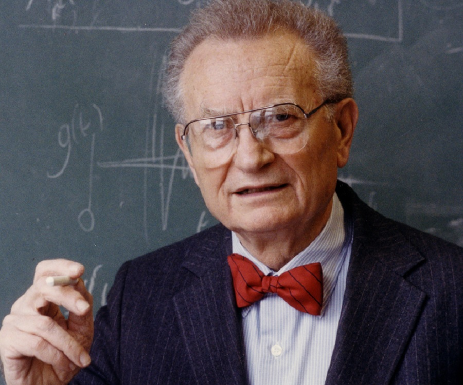

# 1. Introduction {data-background=#A5C1D6}

---

## 1.1 Authors

- Arnauld Costinot
- Phd Economics  @Priceton University
- Currently Professor at Dep of Economics @MIT

## 1.1 Authors

- Dave Donaldson
- Phd Economics @LSE
- Professor at Dep of Economics @MIT

## 1.2 The Ricardian Model

**An Anectode**

>Stan Ulam once challenged Paul Samuelson to name one proposition in the social sciences that is **both true and non-trivial**. His reply was: **‘Ricardo’s theory of comparative advantage’**.

## 1.2 The Ricardian Model

**The Problem**

- **Comparative advantage**: different actors specialise in different economic activities based on their relative productivity differences.

- While the outcome of comparative advantage is clearly verifiable, **comparative productivity is not observable a posteriori**.
  - If a country produces only one good, how can we measure the productivity of the others to compute relative productivity?

## 1.3 Methodology

**Identification Strategy**

1. Focus on one sector, **agriculture**: clear mapping of parameters (soil, water, climate) and outputs (crops).
    - Parameters make up a single factor, called **field**, and obtain the productivity of each field.
2. Compute **expected agricultural production of crops**, given the productivity of factors.
3. Collect data of **observed output** of crops.
4. Run the regression!
    - Expectation: **positive** and significant correlation.

# 2. Data {data-background=#A5C1D6}

---

## 2.1 FAOSTAT

- Gathers data about actual crop output.
- Missing data! In order to minimise missing observations:
  1. Focus **only on year 1989**.
  2. **Only 17** different types of **crops**.
  3. **Only 55 countries**.

## 2.2 The GAEZ

- Open-source dataset of agronomic predictions about the **yield of a certain crop in a given location**.
- approximately yet finely subdivided in zones via satellite/gps
  - 5-arc-minute cells

## 2.2 The GAEZ

$Q_c^g = \sum_{f=1}^{F} A_c^g L_c^g$

- In order to compute predicted output Q, authors employ:
  - A is productivity for crop/good g within field f.
  - L is the only other factor, labour.
  - c is the country.

# 3. Results {data-background=#A5C1D6}

---

## 3.1 Slope Test

**What should we look at?**

- GAEZ data is used to predict the amount of output, given the factor productivity.
- Then predicted output is compared with actual/observed output.

- **Slope tests** are employed, consistently with the literature. Hence, two factors are to be checked:

1. If the coefficient `beta` is close to **unity**.
2. If the coefficient is **precisely estimated**.

## 3.1 Slope Test

**Why the coefficient should be 1?**

- Simply by **regressing actual output on predicted output**.
- If the coefficient of predicted output is 1, it means that there is perfect correspondence between predicted output (X-axis) is actual output (Y-axis).
- In other words, this means that **predicted output *is* actual output**.

## 3.2 A Biased Estimate

**Sources of multiple downward biases**

- The estimate will **necessarily** be biased, as several assumption introduce downward biases.
- For one, only goods produced are *only* the 17 crops on all the disposable land.
  
## 3.2 A Biased Estimate

**But there's more!**

1. **Real factor prices and factor intensities** are assumed to be **the same across all countries**.
2. Ricardian model depends on the ability of **producers/farmers to have perfect information** about productivity of all factors across all countries.
  - Hence they must be knowledgeable about all outcomes of other farmers.
3. This also implies a **common agricultural technology** is shared across all countries.
4. The 5-arc-minute grid is **still too large to assume fields are homogeneous** across the same cell.

## 3.3 The Output

model | plain model 
--- | ---
`log(predicted output)` | **0.212*****
standard error | (0.057)
observations | 349
R-squared | **0.06**

- **Very distant from one**!
  - But remember the several sources of downward bias!
- **Extremely precise** estimate.
- Do not mind low R-squared: we are trying to isolate causal effect, the coefficient!

## 3.3 Robustness Tests - Fixed Effects

model | plain model | crop FE | country FE |
--- | --- | --- | ---
`log(predicted output)` | **0.212***** | **0.244***** | **0.096****
standard error | (0.057) | (0.074) | (0.038)
observations | 349 | 349 | 349
R-squared | **0.06** | **0.026** | **0.54**

1. **Crop specific** fixed-effects **increase R-squared**, so the explanatory power of the Ricardian model is increased.
2. **Country specific** fixed-effects drastically increase R-square.
  - But decrease the estimated coefficient!
  - This perhaps is due to the strong (unverified) assumptions about the uneven distribution of technology, which is captured by the fixed effect (different countries = different technologies)
  
## 3.3 Robustness Test - Outliers?

model | plain model | major countries | major crops |
--- | --- | --- | ---
`log(predicted output)` | **0.212***** | **0.143**** | **0.273*****
standard error | (0.057) | (0.062) | (0.074)
observations | 349 | 226 | 209
R-squared | **0.06** | **0.04** | **0.07**

- Is the outcome driven by the **composition in the sample**? The answers seems to be no.
- Either outcome is **one standard deviation within the whole-sample estimate**.

# 4. Conclusions and Remarks {data-background=#A5C1D6}

---

## 4.1 Conclusions

- Given all the strong assumptions, the Ricardian model performs well.
  - Estimates are precise and robust.
- Kudos for the job:
  - Clever usage of hard data.
  - First analysis of its kind due to fine cell subdivision (despite not enough).

## 4.2 Critiques

- Lack of data makes it impossible to develop an elaborate evaluation:
  - no panel data is remotely possible, so **no checks for convergence** can be made.
  - no **pooled cross sections** seems to be made possible either.